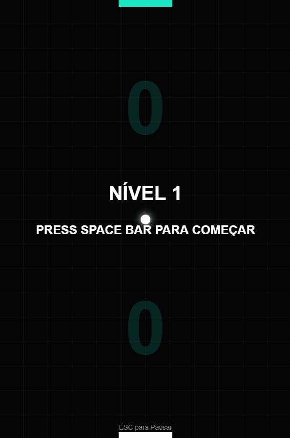

# JackPong 🏓
Estudo, fazer um pong e trabalhar com ideias para aprimoramento  

link para JOGAR ~~> https://jacksonmschroeder.github.io/JackPong/

✅Física da bola e escopo geral do jogo, Mudança importante "verticalidade do jogo"

✅Sistema de Progressão por Níveis

✅Sistema de poderes

✅Inteligência Artificial (Jack) Fiz a reação da "IA" ir em busca da bola só quando ela passa do meio campo para abrir espaço para erro e se tornar um desafio justo. (Ideia inicial de descartada de um multiplicador de velocidade, acabei estendendo a barra)

✅Sistema de Pontuação 

✅Efeitos Visuais (Bordas piscam, bola com um rastro)

✅Sons, efeitos 

✅Créditos

✅Criar uma pasta para o audio para não ficar solto 

✅Particulas + aspectos visuais 

✅Sistema de pause

✅GIF e "profissionalização do "READ.ME" 

Pode vencer o Jack??

"""
Desafios do projeto até a versão 0.1:

A dificuldade do jogo. Cada vez que colocava um multiplicador de velocidade na bola, fatalmente o jogo ficava impossível de jogar depois de um certo tempo. 

Também a IA do inimigo não cometia erros, então eu a refinei para ela não se posicionar sempre ao centro da bola, e coloquei a reação da raquete inimiga para se movimentar só depois que a bola passar do meio-campo...

let targetX = ballX - (currentCompW / 2); <> let targetX = ballX - (currentCompW / 2) + computerErrorX; ~~!~

Também copiei de um tutorial de efeitos de partículas e só adaptei o evento que acontece, >hitball

Nunca tinha lidado com som dentro de um projeto; nessa parte fui obrigado a buscar ajuda na internet. Acabei achando um bom site para sons de jogo (https://sfxr.me).

Agradecimento a todos os amigos que deram sugestões e feedback, sinta-se livre para usar os comentários do repositório para isso!!

